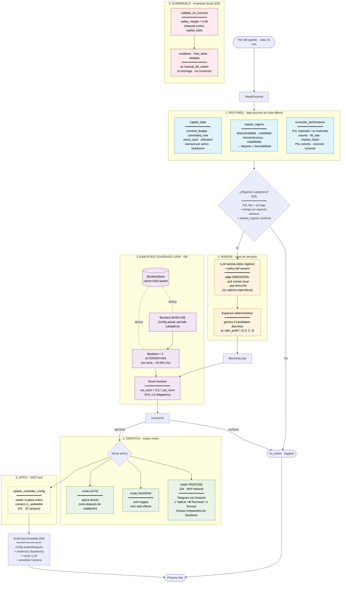
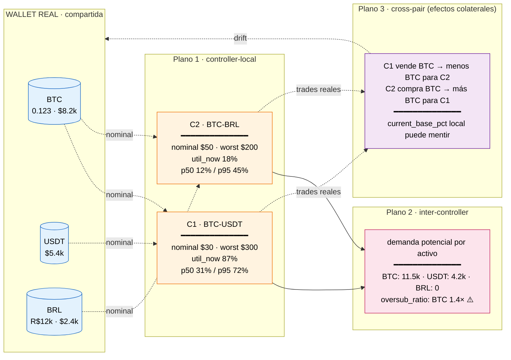

# Architecture Diagram — Adaptive Strategy Framework

> Vista conceptual única, comunicable. Variables clave inline.
> Si querés más detalle de cualquier capa: ver DESIGN.md / DECISIONS.md / CAPITAL_DYNAMICS.md.

## Diagrama principal — flujo del agente por tick

---

## Diagrama secundario — modelo de capital (3 planos)

---

## Variables clave del framework — referencia rápida

| Variable | Decisión | Origen |
|---|---|---|
| Tick del agente | **10 min** | D9 |
| Modos de operación | propose (default MVP) / shadow / auto | D4 |
| Hot-reload | sí, nativo via Pydantic `is_updatable` | D1 |
| Campos NO updatables | connector, trading_pair, position_mode, leverage*, kill_switch* | D7 + Hummingbot |
| Safety margin (oversub) | 0.95 | D9 |
| Cooldown entre cambios | configurable, default 30 min | D4 |
| Histórico de capital | JSONL, 1 archivo por controller, retain 30d | CAPITAL_DYNAMICS |
| Lookback percentiles | 24h | CAPITAL_DYNAMICS |
| Connectors no soportados (backtest) | hyperliquid, dydx, kraken, coinbase_advanced | D9 |
| Score backtest | `vol_norm + 0.3 × pnl_norm` (PnL≥0) | D9 |
| Expansor de propuestas | LLM elige dimensión + dirección, código genera 3 valores | D9 |

\* leverage es technically `is_updatable` pero por política humano-only.

---

## Cómo leer este diagrama

- **Cajas con borde azul** = Routines (data, sin acción).
- **Naranja** = Capa de decisión (LLM + código determinístico).
- **Violeta** = Backtests (evidencia empírica antes de proponer).
- **Rojo** = Guardrails (invariants duros, último filtro).
- **Verde** = Dispatch (cómo se entrega la propuesta según modo).
- **Amarillo** = Aplicación (la única capa que toca el controller real).

**Toda decisión que llega al humano pasó por: routines → LLM → expansor → backtests → invariants.** Cualquier paso que falle, no llega.
